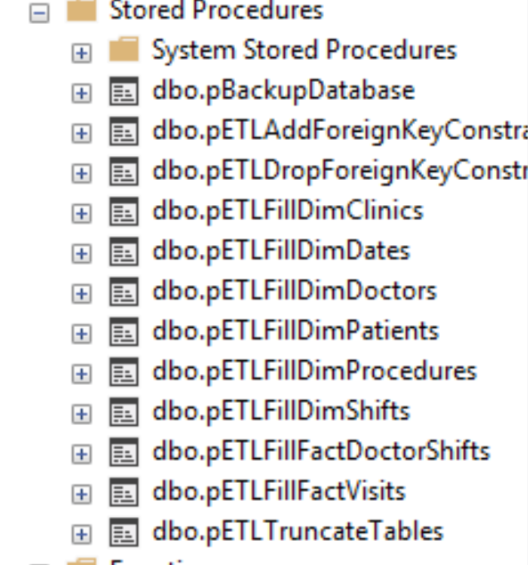
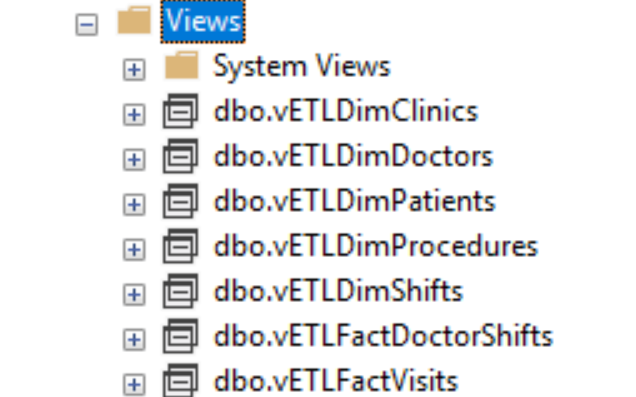
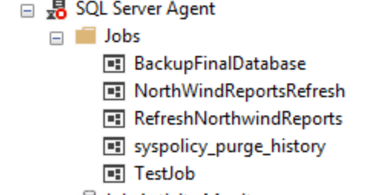
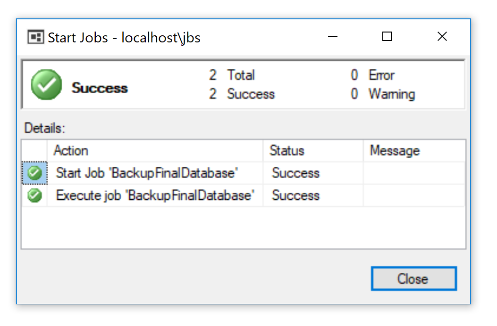
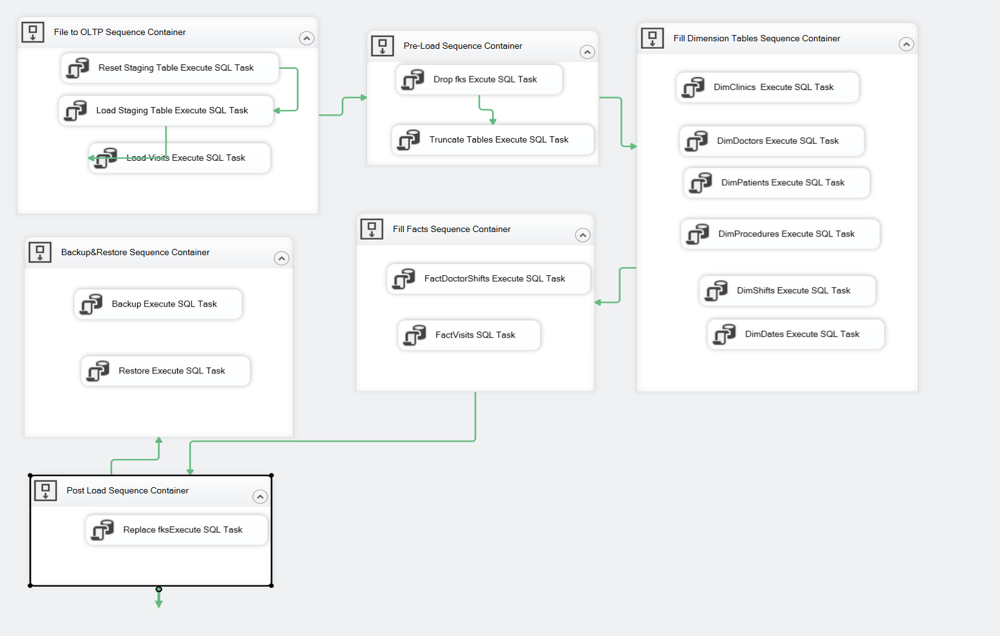
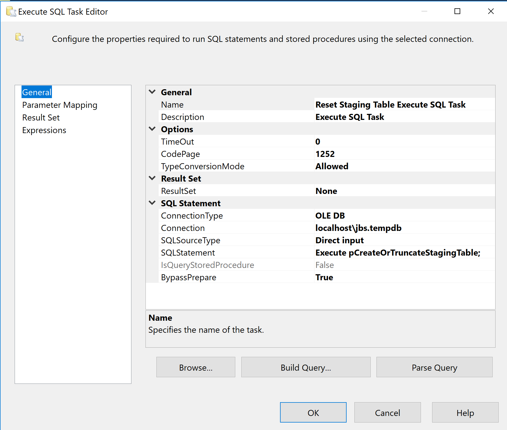

# SQL_SSIS_clinic-database
This repository contains materials which perform ETL task for multiple clinic's databases.

Author : Byungsu Jung

Date : 08/16/2018

### ETL Process

#### Introduction  
This document is a technical support document that illustrates whole ETL process from reading flat file to extract data to backup database using job. The ETL process starts with extracting data from comma separated value file. Once the data is extracted, the staging tables are created to receive the data extracted and load data into OLTP database. Once the data loading to OLTP database is finished, the data in OLTP is also loaded into OLAP Data warehouse for reporting purposes. Once all the ETL process is completed, I have created a job in SQL management studio to process daily Backup task of all the database used in this ETL process.
The whole ETL process is very similar to normal ETL process conducted in another field. The following is outline of the process.

** Make sure to run the program as Administrator **

The following is an outline of entire ETL process of the Patient database and DWClinicReportData.

-	Extract data from flat file
-	Load the extracted data into staging table and synchronize the staging table with the Patients.dbo.Visits table.
-	Create DWClinicReportData databse
-	Pre-load process
-	DWClinicReportData ETL process
-	Post-load process
-	Create a job that performs backup task.
-	Create SSIS for whole ETL process


1.	Extract data from flat file
In order to extract data from provided flat files, staging table is created to hold the data before it is transferred into the OLTP database.


```SQL

Create Procedure pETLImportDataIntoStagingTables
/* Author: <ByungSu Jung>
** Desc: Flushes all date from the tables
** Change Log: When,Who,What
** 20189-01-17,<ByungSu Jung>,Created Sproc.
*/
AS
 Begin
  Declare @RC int = 0;
  Begin Try   

	Bulk Insert
	TempDB.dbo.stagingBellevue
	From 'C:\Users\jbsoo\Desktop\Info498\Info 498 Final\DataFiles\Bellevue\20100102Visits.csv'
	With(FirstRow = 2,Fieldterminator = ',',Rowterminator = '\n')

	Bulk Insert
	TempDB.dbo.stagingKirkland
	From 'C:\Users\jbsoo\Desktop\Info498\Info 498 Final\DataFiles\Kirkland\20100102Visits.csv'
	With(FirstRow = 2,Fieldterminator = ',',Rowterminator = '\n')

	Bulk Insert
	Tempdb.dbo.stagingRedmond
	From 'C:\Users\jbsoo\Desktop\Info498\Info 498 Final\DataFiles\Redmond\20100102Visits.csv'
	With(FirstRow = 2,Fieldterminator = ',',Rowterminator = '\n')
   Set @RC = +1
  End Try
  Begin Catch
   Print Error_Message()
   Print 'Error in excuting pETLImportDataIntoStagingTables. Common error: incorrect file name.'
   Set @RC = -1
  End Catch
  Return @RC;
 End
go


```

Figure01. Bulk Insert
Once the tables are created, the SQL Bulk Insert statement is used to read the data in flat file and load the data into the staging tables.


2.	Load the extracted data into staging table and synchronize the staging table with the Patients.dbo.Visits table.
Once the data has been loaded into staging table that is constructed for storing data before it is transferred into the OLTP database, pETLSyncVisit procedure synchronize the data in staging table and the Patients.dbo.Visits table in OLAP database by using merge technique.


```SQL
Create Procedure pETLSyncVisit
/* Author: <ByungsuJung>
** Desc: Inserts data into FactOrders
** Change Log: When,Who,What
** 20189-01-17,<ByungsuJung>,Created Sproc.
*/
AS
 Begin
  Declare @RC int = 0;
  Begin Try
	Merge Into Patients.dbo.Visits as TargetTable
	Using vETLVisit as SourceTable
		On TargetTable.[Date] = SourceTable.[Date] And
		   TargetTable.[Clinic] = SourceTable.[Clinic] And
		   TargetTable.[Patient] = SourceTable.[Patient] And
		   TargetTable.[Doctor] = SourceTable.[Doctor] And
		   TargetTable.[Procedure] = SourceTable.[Procedure] And
		   TargetTable.[Charge] = SourceTable.[Charge]
		When Not Matched
			Then
			Insert
			Values (SourceTable.[Date], SourceTable.[Clinic], SourceTable.[Patient],                  SourceTable.[Doctor], SourceTable.[Procedure], SourceTable.[Charge])
   ;
   Set @RC = +1
  End Try
  Begin Catch
   Print Error_Message()
   Print 'Error in excuting pETLSyncVisit. Common error: incorrect column match.'
   Set @RC = -1
  End Catch
  Return @RC;
 End
go

```

Figure02. pETLSyncVisit

3.	Create DWClinicReportData
The creation of DWClinicReportData is done by running the SQL script file called ‘Create DWClinicReportData’


4.	Pre-load process
The pre-load process represents the process required to be succeeded before performing actual ETL process. In this case, the pre-load process consists of truncate table process and drop foreign key constraint process. The stored procedure named pETLDropForeignKeyConstraints is created to perform foreign key constraint dropping process.

```SQL

Create Procedure pETLDropForeignKeyConstraints
. . .
Alter Table [DWClinicReportData].dbo.FactVisits
	  Drop Constraint fkFactVisitsToDimClinics;

	Alter Table DWClinicReportData.dbo.FactVisits
	  Drop Constraint fkFactVisitsToDimDates
. . .

```

Figure03. pETLDropForeignKeyConstraints

```SQL
Create Procedure pETLTruncateTables
. . .
   Truncate Table DWClinicReportData.dbo.DimClinics
    Truncate Table DWClinicReportData.dbo.DimDates
    Truncate Table DWClinicReportData.dbo.DimDoctors
.  .  .

```


Figure04. pETLTruncateTables

6.	DWClinicReportData ETL Process
In this process, I have created view and procedure for each tables. Following are list of the view and procedures created to load the data into OLAP report Data warehouse from OLTP database

  - [dbo].[vETLDimClinics]		-		[dbo].[pETLFillDimClinics]
  - NA					-		[dbo].[pETLFillDimDates]
  - [dbo].[vETLDimDoctors]		-		[dbo].[pETLFillDimDoctors]
  - [dbo].[vETLDimPatients]		-		[dbo].[pETLFillDimPatients]
  - [dbo].[vETLDimProcedures]		-		[dbo].[pETLFillDimProcedures]
  - [dbo].[vETLDimShifts]		-		[dbo].[pETLFillDimShifts]
  - [dbo].[vETLFactDoctorShifts]		-		[dbo].[pETLFillFactDoctorShifts
  - [dbo].[vETLFactVisits]		-		[dbo].[pETLFillFactVisits]




Figure05. Stored procedures and views

Each of the view extract the data from multiple tables in OLTP database and convert the value into the format that matches the format of OLAP Data Warehouse.
Then, each view tables are used in Stored Procedures to Insert data into the OLAP Data Warehouse. For example, the following are view and stored procedure for the table DimClinic.

```SQL
Create View vETLDimClinics
/* Author: <ByungsuJung>
** Desc: Extracts and transforms data for DimClinics
** Change Log: When,Who,What
** 08/15/2018,<ByungsuJung>,Created Sproc.
*/
As
  Select
   [ClinicID] = c.ClinicID,
   [ClinicName] = Cast(IsNull(c.ClinicName, 'Missing Data') as nvarchar(100)),
   [ClinicCity] = Cast(IsNull(c.City, 'Missing Data') as nvarchar(100)),
   [ClinicState] = Cast(IsNull(c.State, 'Missing Data') as nvarchar(100)),
   [ClinicZip] = Cast(IsNull(c.Zip, 'Missing Data') as nvarchar(100))
  FROM DoctorsSchedules.dbo.Clinics as c
go

```
Figure06. vETLDimClinics

```SQL
Create Procedure pETLFillDimClinics
/* Author: <ByungSu Jung>
** Desc: Inserts data into DimClinics using the vETLDimClinics view
** Change Log: When,Who,What
** 08/15/2018,<ByungSu Jung>,Created Sproc.
*/
AS
 Begin
  Declare @RC int = 0;
  Begin Try
    -- ETL Processing Code --
    IF ((Select Count(*) From DimClinics) = 0)
     Begin
      INSERT INTO DWClinicReportData.dbo.DimClinics
       ([ClinicID], [ClinicName], [ClinicCity], [ClinicState], [ClinicZip])
      Select
	   [ClinicID], [ClinicName], [ClinicCity], [ClinicState], [ClinicZip]
      FROM vETLDimClinics
    End
   Set @RC = +1
  End Try
  Begin Catch
   Print Error_Message()
   Set @RC = -1
  End Catch
  Return @RC;
 End
go

```

Figure06. Stored procedures pETLFillDimClinics

8.	Post-Load process

The post load process is a finishing step of ETL process. In this process, the foreign key constraints that had been removed for ETL purposed are restored.


```SQL
Create Procedure pETLAddForeignKeyConstraints
. . . . .
     Alter Table [DWClinicReportData].dbo.FactVisits
	  Add Constraint fkFactVisitsToDimClinics
	  FOREIGN KEY (ClinicKey) REFERENCES DimClinics(ClinicKey);

	Alter Table DWClinicReportData.dbo.FactVisits
	  Add Constraint fkFactVisitsToDimDates
	  FOREIGN KEY (DateKey) REFERENCES DimDates(DateKey);
. . . .

```


Figure07. pETLAddForeignKeyConstraints


9.	Create a job that performs the backup task
To create a job that performs the task that you wish to perform, there exist a section called SQL SERVER AGENT in Object Explorer where Jobs folder lies within. To create a new job, right click Jobs and select Create New Job.

In this process, the BackupFinalDatabse job is created in the SQL Sever Agent to perform a backup task for all the database used in ETL process namely [DWClinicReportData], [Patients] and [DoctorsSchedules].


Figure08. SQL Server Agent
The newly created job is assigned a task to perform in step section, and  the schedule to perform a task in schedule section. Once the job is created, test the job by right clicking the newly created job and select ‘Start Job at Step..’.




Figure09. Test Job


10.	Create SSIS for whole ETL process



Figure09. SSIS Flow chart

Creating SSIS package that performs the ETL process as same as one illustrated in this document is final task of the whole ETL process.
The process starts with creating connection to both DWClinicReportData and tempdb to call the stored procedure created previously.


   
Figure10. Connection

Once the connections are set, drag Excute SQL Task from SSIS tool box and assign them different connection and SQL commend that are required for each ETL processes.
 
Figure11. Execute SQL Task Editor

### Summary
The whole ETL process in this document consist of extract data from flat file, load the extracted data into staging table and synchronize the staging table with the Patients.dbo.Visits table, create DWClinicReportData database, pre-load process, DWClinicReportData ETL process, post-load process, create a job that performs backup task and create SSIS for whole ETL process.
This document illustrates the entire ETL process from flat file process to backup. This process can be used in different ETL task by altering variable names. Each step in the document must be processed to successfully perform ETL process. Also, the order of steps should be strictly followed to avoid error message.
